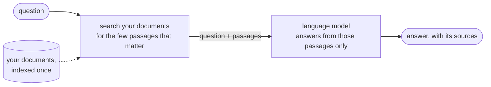

# Ragstone

[](https://github.com/DongxuGuo1997/ragstone/actions/workflows/ci.yml)
[](LICENSE)


**A foundation stone for grounded Q&A applications.**

Ragstone is a Retrieval-Augmented Generation (RAG) engine for smaller
applications: documents in, cited answers out, one model call per
answer, and fully local with Ollama if you want it. It ships with an
evaluation harness that fails the build when quality drops, and it runs
as a Python library, a web UI, a CLI, a REST API, or an MCP tool for
agents. Built with LangChain 1.x and LangGraph.

## Why Ragstone?

RAG didn't get replaced by agents — it became the primitive they stand on.
Ragstone (a real building stone) explores what that foundation should
look like:

- **Efficient by design** — a fixed, deterministic pipeline: one retrieval,
  one LLM call, predictable latency and cost. An optional agent mode exists
  so you can measure exactly what an agent loop buys you.
- **Local-first** — runs fully offline with Ollama, FAISS, and a local
  cross-encoder reranker. No API key required, and `RAGSTONE_PROFILE=local`
  turns "nothing leaves the machine" into an enforced, tested invariant.
- **Measured, not vibes** — ships an eval harness (retrieval hit rate/MRR
  plus an LLM judge for correctness and faithfulness) that fails the build
  if quality regresses against the committed baseline.
- **A tool for agents** — the bundled MCP server makes your documents a
  first-class tool for Claude, Cursor, or any MCP-compatible client.

## Where it comes from

Ragstone began as a learning project: one person working through RAG and
LangChain by building a pipeline and asking, at every step, "does this
actually help?" That habit of measuring an idea before keeping it is what
the project grew around. Along the way it picked up an eval harness, a
fully local mode, an agent mode built mostly to be compared against the
fixed pipeline, a REST API, an MCP server and a complete vertical use
case. It is still exploratory — the experiment log records the ideas
that failed next to the ones that shipped — but the engine underneath is
tested, measured and usable.

It is also a test ground for building software with an AI pair. Much of
the code, the documentation and the experiment write-ups were drafted in
collaboration with Claude, Anthropic's coding assistant, and that is
exactly why the eval gates matter: an idea from either of us ships only
when the numbers hold, and the maintainer reviews and answers for every
commit.

## New to RAG? Start here

A language model answers from what it memorised during training. It has
never seen your documents, and retraining it for every new file is
neither practical nor private. Retrieval-augmented generation (RAG) adds
one step: at question time, *search* your documents for the few passages
that matter, hand those passages to the model together with the
question, and tell it to answer from them only. The answer comes back
with the passages it used, so it can be checked.



The search hop is the whole difference. Everything in this repo is
about doing that hop well, and proving that it works.

**Words you will meet.** A document is split into *chunks* (passages of
about a thousand characters). Each chunk is turned into an *embedding*
(a list of numbers that captures its meaning) and stored in a *vector
store*, so a question can be matched against meaning, not just exact
words. The *retriever* is the search step; *hybrid* means it also runs a
classic keyword search (BM25) and merges the two. A *reranker* is an
optional second pass that reorders the candidates more carefully. The
*chain* is the recipe from question to answer (the default is one
search, one model call). *Faithfulness* asks whether every claim in the
answer is supported by the retrieved passages; a claim that is not is a
*hallucination*. An *LLM judge* is a model used to grade answers at
scale, which is how this repo measures itself.

**Your first fifteen minutes.**

1. Follow the quick start below, then copy the bundled test documents
   into place: `cp evals/corpus/*.md data/`. They describe a fictional
   world, so the model cannot answer from memory, only from the files.
2. Open the UI, click **Build Pipeline**, and ask
   *"When did the Aurora-7 mission launch?"* Open the sources under the
   answer: the highlighted words are what the answer was built from.
3. Ask something the documents do not cover and watch it decline
   instead of inventing an answer. That refusal is a tested behaviour.
4. Run `make eval-retrieval`. It checks, for 49 known questions, whether
   the right passage came back. This is what "measured" means here.
5. Then read [docs/HOW_IT_WORKS.md](docs/HOW_IT_WORKS.md), which walks
   the whole mechanism stage by stage in the same plain language.

Prefer a terminal? `ragstone-chat --data-dir evals/corpus` does steps
two and three without the browser.

## Quick start

Requires Python 3.10+, and either an OpenAI API key or a running
[Ollama](https://ollama.com/) for the local path.

```bash
git clone https://github.com/DongxuGuo1997/ragstone.git
cd ragstone
python -m venv venv && source venv/bin/activate   # Windows: venv\Scripts\activate
pip install -e .
cp .env.example .env                              # add OPENAI_API_KEY for the cloud path
ragstone                                          # the chat UI (or: make run-streamlit)
```

In the sidebar, pick OpenAI or Ollama, upload documents or paste URLs,
click **Build Pipeline**, and ask.

**Fully local, no key:**

```bash
ollama pull qwen3.5:9b && ollama pull embeddinggemma
ragstone                                          # choose Ollama in the sidebar
```

## Measured, not vibes

Every default was chosen by an experiment, and several features were
*rejected* for default status by their own measurements and kept as
labeled opt-ins. A few of the verdicts the harness produced:

| Question | Verdict |
|---|---|
| Does an agent loop beat the fixed pipeline? | Identical quality at **1.8× latency, 1.45× tokens** → the pipeline stays default |
| Does self-correcting retrieval pay? | Looked like a win on 43 questions, **failed to replicate on 224** → opt-in, honestly labeled |
| Can the local stack match the cloud path? | qwen3.5:9b + embeddinggemma: correct **0.951** / faithful **1.0**, at the gpt-4o-mini reference |
| Can CV↔assignment matching be measured? | Strong-candidate recall@5 **1.0**, no-full-match honesty **1.0**; top-5 precision **0.95** at 400 consultants |


The full tables — every configuration, the support-tier policy, the
local-stack numbers by hardware tier — are in
[docs/BENCHMARKS.md](docs/BENCHMARKS.md). The hypothesis → method →
decision log, including the experiments that were wrong, is
[EXPERIMENTS.md](EXPERIMENTS.md).

Run the harness yourself:

```bash
make eval-retrieval        # retrieval layer: hit rate + MRR, free
make eval                  # + LLM-judged correctness and faithfulness (cents)
make eval-local            # the same, on the local stack
```

Each run is compared against `evals/baseline.json`; any metric dropping
more than 0.05 fails the run.

## Ways to use it

| Surface | Start it | Docs |
|---|---|---|
| Chat web UI (Streamlit) | `ragstone` | this page |
| CLI chat | `ragstone-chat` | [docs/HOW_IT_WORKS.md](docs/HOW_IT_WORKS.md#four-front-doors-one-engine) |
| MCP server for agents (Claude, Cursor, VS Code) | `ragstone-mcp` | [docs/README_MCP.md](docs/README_MCP.md) |
| REST API (streaming, auth, metrics, tracing) | `pip install -e ".[api]"`, then `ragstone-api` | [docs/DEPLOYMENT.md](docs/DEPLOYMENT.md) |
| Staffing-match UI (the showcase) | `ragstone-match` | [docs/CV_MATCHING.md](docs/CV_MATCHING.md) |
| Python library | below | [docs/HOW_IT_WORKS.md](docs/HOW_IT_WORKS.md) |

### As a library

```python
from ragstone import OpenAIPipeline

pipeline = OpenAIPipeline(model="gpt-4o-mini")
pipeline.load_and_split(
    data_dir="data",
    page_urls=["https://example.com"],
    wiki_query="artificial intelligence",
)
pipeline.set_retriever_openai(use_ensemble=True)
pipeline.create_rag_chain(chain_type="simple")
print(pipeline.ask_question("What is artificial intelligence?"))
```

Errors are typed: catch `PipelineError` (or a subclass such as
`LLMInitializationError`) from `ragstone.utils`; each carries a user-safe
`.message` and a `.context` dict.

## What's inside

- **Providers**: OpenAI (any chat model by name) and Ollama (Llama, Qwen,
  Gemma, DeepSeek, ...). One code path for the language model and the
  embeddings, whichever provider you pick.
- **Sources**: local files (PDF, TXT, CSV, DOCX, Markdown), web pages,
  Wikipedia, drag-and-drop upload.
- **Retrieval**: hybrid BM25 + vector ensemble, document identity in
  every chunk, one extracted metadata card per document (so "who wrote
  this?" works), optional cross-encoder reranking, and an incremental
  embedding cache so re-ingesting embeds only what changed.
- **Chains**: `simple` (default: one retrieval, one call), `multi_query`,
  `fusion`, `corrective` (retrieval grades itself and refuses with
  evidence), `auto` (a cheap router picks simple or corrective), and
  `agent` (the LLM drives the retrieval loop). Which one earns its cost
  on which corpus is measured, not assumed — see above.
- **Vector stores**: FAISS (default), Qdrant (embedded or server),
  pgvector, Chroma (legacy). Retrieval parity across backends is enforced
  by test.
- **Memory**: multi-turn conversation with follow-up rephrasing; durable
  across restarts with the `sqlite` extra.
- **Answers that show their work**: source snippets highlight the exact
  words the answer reuses.

Optional extras: `rerank`, `sqlite`, `api`, `qdrant`, `pgvector`, `otel`,
or everything at once with `pip install -e ".[all]"`. What each adds and
when to enable it: [docs/DEPLOYMENT.md](docs/DEPLOYMENT.md).

## The staffing-match showcase

A complete vertical use case built on the engine: paste a client
assignment request, get an evidence-backed shortlist from a pool of
consultant CVs. Every claim cites the CV verbatim, gaps are reported as
"not evidenced in the CV", and honesty on an unsatisfiable brief is a
gated metric. With Ollama the whole match runs on the laptop; the repo
ships only synthetic CVs.

```bash
ragstone-match                       # dedicated UI (or: make run-match-ui)
python evals/run_staffing_eval.py    # the measured gate
```

How it works and the measurements: [docs/CV_MATCHING.md](docs/CV_MATCHING.md).
Presenting it live: [docs/guides/STAFFING_DEMO_SCRIPT.md](docs/guides/STAFFING_DEMO_SCRIPT.md).

## Configuration

Everything is configured through environment variables (`.env` is read
automatically). The ones you are most likely to touch:

```bash
OPENAI_API_KEY=...                    # cloud path
OLLAMA_BASE_URL=http://localhost:11434
VECTOR_STORE_TYPE=faiss               # qdrant | pgvector | chroma
RAGSTONE_PROFILE=local                # enforce no-egress; fails closed at boot
RAGSTONE_OLLAMA_REASONING=off         # thinking off for local models: far faster answers
RAGSTONE_LLM_TIMEOUT=60               # per-request timeout, seconds
```

The complete, commented list is [.env.example](.env.example). From code,
adjust `get_config()` before building a pipeline (for example
`config.loader.chunk_size = 800`).

> Persisted vector stores must be rebuilt if the embedding model changes —
> embeddings from different models are not compatible.

## Project layout

```
src/ragstone/
├── rag/        pipeline, chains (simple / multi_query / fusion / corrective / router / agent),
│               loaders, splitter, embeddings + cache, vector stores, memory, citations
├── match/      the CV↔assignment matcher (LangGraph)
├── models/     OpenAI / Ollama proxies with retries and timeouts
├── config/     settings, profiles, boot checks
├── api/        REST server and API keys
├── mcp/        MCP server
├── ui/         Streamlit chat UI, staffing UI, CLI chat
└── utils/      observability, metrics, security guards, exceptions
evals/          eval harness, golden sets, corpora, baselines
tests/          unit + integration tests (no network needed)
docs/           mechanism docs and guides (map below)
```

## Documentation map

| Read | For |
|---|---|
| [New to RAG? Start here](#new-to-rag-start-here) | the idea in one picture, the vocabulary, a first fifteen minutes |
| [docs/HOW_IT_WORKS.md](docs/HOW_IT_WORKS.md) | the engine, stage by stage |
| [ARCHITECTURE.md](ARCHITECTURE.md) | design decisions, and what was deliberately not built |
| [docs/BENCHMARKS.md](docs/BENCHMARKS.md) | every measured result and the support-tier policy |
| [EXPERIMENTS.md](EXPERIMENTS.md) | the experiment log: hypothesis → method → decision |
| [docs/DEPLOYMENT.md](docs/DEPLOYMENT.md) | REST API, Docker, vector stores, memory, observability |
| [docs/README_MCP.md](docs/README_MCP.md) | MCP server setup for Claude, Cursor, VS Code |
| [docs/CV_MATCHING.md](docs/CV_MATCHING.md) | the staffing matcher |
| [SECURITY.md](SECURITY.md) | threat model, deployment modes, where user text lives |
| [ROADMAP.md](ROADMAP.md) | what's next, with acceptance criteria |
| [CHANGELOG.md](CHANGELOG.md) | release notes |

## Testing and contributing

```bash
pip install -e ".[dev]"
pytest tests/ -q                       # no network, no API key
black --check src/ tests/ && isort --check-only src/ tests/ && flake8 src/ tests/
mypy src/ragstone
```

Two rules shape every contribution: quality-affecting changes are
eval-gated, and the golden set and the system under test never change in
the same measured comparison. Details in
[CONTRIBUTING.md](CONTRIBUTING.md); bug reports and feature requests via
[GitHub Issues](https://github.com/DongxuGuo1997/ragstone/issues).

## Security

Never commit `.env`. Inputs are validated and length-capped before any
API spend, FAISS loads with safe defaults, errors never leak internals,
and `RAGSTONE_PROFILE=local` refuses every non-loopback endpoint at boot.
Tracing (LangSmith, OTLP) is off unless you enable it — and LangSmith
traces carry document text. The threat model and the deployment
checklist are in [SECURITY.md](SECURITY.md).

## License

MIT — see [LICENSE](LICENSE).

## Acknowledgments

- [LangChain](https://github.com/langchain-ai/langchain) and LangGraph
- [Streamlit](https://streamlit.io/)
- [FAISS](https://github.com/facebookresearch/faiss), [Qdrant](https://qdrant.tech/), [pgvector](https://github.com/pgvector/pgvector), [Chroma](https://github.com/chroma-core/chroma)
- [OpenAI](https://openai.com/) and [Ollama](https://ollama.com/)
