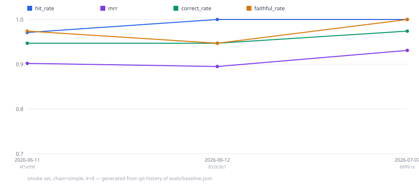

# Ragstone

**A foundation stone for grounded Q&A applications.**

Ragstone is an efficient Retrieval-Augmented Generation (RAG) engine for
smaller applications: one LLM call per answer, fully local operation with
Ollama if you want it, and measurable answer quality via a built-in
evaluation harness. Use it as a Python library, a Streamlit app, a CLI
chat, or as an MCP tool that puts your documents in reach of any agent
(Claude, Cursor, ...). Built with LangChain 1.x and LangGraph.

## Why Ragstone?

RAG didn't get replaced by agents — it became the primitive they stand on.
Ragstone (a real building stone) leans into being that foundation:

- **Efficient by design** — a fixed, deterministic pipeline: one retrieval,
  one LLM call, predictable latency and cost. An optional agent mode exists
  so you can measure exactly what an agent loop buys you (see below).
- **Local-first** — runs fully offline with Ollama, FAISS, and a local
  cross-encoder reranker. No API key required.
- **Measured, not vibes** — ships an eval harness (retrieval hit rate/MRR
  plus an LLM judge for correctness and faithfulness) that fails the build
  if quality regresses against the committed baseline.
- **A tool for agents** — the bundled MCP server makes your documents a
  first-class tool for Claude, Cursor, or any MCP-compatible client. In an
  agentic world, the agent is the customer; Ragstone is the ground it
  stands on.

## Measured, at a glance

Questions this codebase answered with its own eval harness instead of
opinion:

| Question | Verdict |
|---|---|
| Does an agent loop beat the fixed pipeline? | Identical quality, **1.8× latency, 1.45× tokens** → the pipeline stays default |
| Does self-correcting retrieval (CRAG) pay? | Looked like +0.027 at n=43; **failed to replicate at n=224** — quality within noise, 2× cost is not → opt-in, honestly labeled |
| Was the small eval set lying to us? | Yes, once: scaling 43 → 224 cases reversed a conclusion (Exp 9) — design verdicts now require `--set large` |
| Where do follow-up seconds go? | **926 ms** in one rephrase LLM call → prompt + model fix: multi-turn quality **0.8 → 1.0** on the 5-case smoke slice, rephrase **−40%** |
| Are smaller chunks sharper? | No — hit rate **drops** 1.0 → 0.914 at 500 chars |
| Is concurrent embedding safe? | **3.1× faster** ingestion, identical vectors and retrieval metrics |
| Does chunk enrichment beat more context? | Document identity in the chunk: hit **+1.5pp**, faithfulness **+2.9pp** at +5.7% tokens — now the default; k=6's extra volume had *hurt* |
| Can a router capture self-correction's edge cheaply? | Quality held (faithfulness up to **0.981** tuned), but **1.25× tokens** still fails the pre-set gate after tuning → `auto` ships opt-in, `simple` stays default (Exp 15/15b) |
| Does the thread model survive real load? | p50 flat to **32 concurrent clients**, instant 429s beyond the cap, **~7× payoff** on parallel generation; the load test also caught two API design bugs (Exp 16) |
| Can a nano model run the rephrase step? | −40% latency and a green gate — then a live transcript showed it echoing answers on "are you sure?" turns the eval set never covered. **Reverted same day**, prompt hardened, blind spot added to the golden set (Exp 18) |
| Can RAG answer "who wrote this paper?" | Not from content chunks — the references section decoys every authorship query. One extracted **metadata card** per document: misattribution eliminated on a 79-chunk PDF, MRR +1.6 on the golden set (Exp 19) |
| Can the local stack match the cloud path? | After a 622 MB embedder swap and temperature parity: smoke correct **0.951–1.0 / faithful 1.0**, multi-turn 1.0 — at the cloud reference; on real regulations, local ≈ cloud (Exp 21/25/26) |
| Does reasoning mode fix weak retrieval? | No — identical correctness at **33× latency**; a 274→622 MB embedder swap fixed what thinking couldn't (Exp 25) |
| Can CV↔assignment matching be *measured*? | Ground truth by construction: strong-candidate recall@5 **1.0**, no-full-match honesty **1.0** — and the pilot's imperfect scores caught two real matcher bugs before any human read a transcript (Exp 27) |

Full methods and numbers: [EXPERIMENTS.md](EXPERIMENTS.md) · Design
reasoning and trade-offs: [ARCHITECTURE.md](ARCHITECTURE.md) · What's
next, with acceptance criteria: [ROADMAP.md](ROADMAP.md)

Because baselines are committed with every quality change, the repo can
chart its own measured trajectory — generated from git history, no
hand-typed numbers (`python evals/quality_history.py`):



## Support tiers: what's guaranteed, what's optional, and when to enable it

A deliberate policy, not an accident: several features below were
**rejected for default status by their own experiments** and kept anyway
— as measured options for the corpora where the trade-off flips. Every
default is CI-gated; every opt-in is baselined and carries an explicit
*enable-when* condition; combinations off this list are best-effort.

| Option | Tier | Measured niche | Enable when |
|---|---|---|---|
| `simple` chain, k=4, ensemble, enrichment, embed cache | **default** (CI-gated) | the measured optimum on the eval corpus | — |
| document metadata cards | **default** (CI-gated) | "who wrote this?" answered from the document's own header; references-decoy misattribution eliminated (Exp 19) | disable via `RAGSTONE_METADATA_CARDS=off` if your corpus has no metadata questions |
| `corrective` chain | opt-in | faithfulness 0.986 vs 0.967; refuses with evidence instead of hallucinating (Exp 8/9/12) | a wrong answer costs more than a refusal. The hit<0.9 trigger looked validated at n=27 but shrank to noise at n=68 (Exp 23→24) — directionally supported, unproven |
| `auto` routing | opt-in | corrective's edge on flagged questions at 1.25× instead of 2× (Exp 15/15b) | you want corrective's insurance without paying it on every lookup |
| `agent` chain | opt-in | none on this corpus — identical quality at 1.8× latency | first-shot retrieval fails often enough that re-searching pays; measure it on YOUR corpus |
| `multi_query` | opt-in | none measured (Exp 4; multi-turn faithfulness DROPS on the regulatory corpus, Exp 24) | rarely — measure on your corpus first |
| `fusion` | opt-in | **best chain on the regulatory corpus**: correct +10.7pp, faithful 0.982 (Exp 24) at 2.3× tokens | your corpus has near-duplicate or tiered passages (fine schedules, versioned clauses, recitals mirroring articles) |
| `[rerank]` cross-encoder | opt-in | biggest ranking lever: MRR 0.93 → 1.0 (smoke) | ranking precision matters and ~80 MB local model + latency is acceptable |
| `RAGSTONE_CHUNK_CONTEXT=llm` | opt-in | untested beyond `source` mode | document names carry no meaning, so the free identity line can't disambiguate |
| `qdrant` / `pgvector` stores | opt-in (operational) | FAISS parity by test (Exp 13) | you need persistence, server-mode sharing, or the Postgres you already run |
| `sqlite` memory | opt-in (operational) | — | conversations must survive restarts |
| `chroma` store | **legacy** | none — the embedded-persistent niche is Qdrant-local's, which has parity tests Chroma lacks | migrating from an existing Chroma deployment only |

The verdicts above began as single-corpus results; the second, real
corpus (EU regulations, Experiments 23–24, n=68) has now put them on
trial with statistical power: enrichment and chunk-size held, fusion
FLIPPED (near-duplicate passages are its measured niche), multi_query
stayed rejected, and corrective's brief n=27 validation was walked
back at n=68 — the harness catching its own newest claim, twice proving
that small-slice verdicts don't survive scale (the Experiment 9
lesson).

## Features

### Multiple LLM Providers
- **OpenAI**: GPT-4o Mini, GPT-4o, GPT-4.1 (any chat model by name)
- **Ollama**: Llama3, Phi4, DeepSeek-R1, and other local models

### Flexible Data Sources
- **Local Files**: PDF, TXT, CSV, DOCX, Markdown
- **Web Pages**: Automatic scraping and content extraction
- **Wikipedia**: Search and load articles automatically
- **File Upload**: Drag-and-drop interface for documents

### RAG Techniques
- **Simple RAG**: Standard retrieval-augmented generation
- **Multi-Query RAG**: Generates multiple queries for retrieval
- **Fusion RAG**: Uses reciprocal rank fusion
- **Ensemble Retrieval**: Combines BM25 and vector similarity
- **Cross-Encoder Reranking** (optional): Two-stage retrieval for higher precision
- **Agent Mode**: LLM-driven retrieval loop, for measured comparison against the fixed pipeline
- **Corrective RAG**: retrieval grades itself, rewrites failed queries, and refuses with evidence — its apparent quality win at n=43 failed to replicate at n=224 (Experiment 9), which is the point of measuring
- **Query Routing** (`auto`, opt-in): a cheap classifier sends each question to simple or corrective — kept opt-in because its own cost gate said so (Experiments 15/15b)
- **Evidence Highlighting**: source snippets mark the exact words the answer reuses — post-hoc alignment, no prompt changes
- **Document Metadata Cards**: one extracted title/authors/date chunk per document, so "who wrote this?" retrieves the author block instead of the references-section decoy (Experiment 19)

### Vector Store Support
- **FAISS** (default): fast in-process similarity search
- **Qdrant**: embedded local mode or a server via one env var (`[qdrant]` extra)
- **pgvector**: RAG on the Postgres you already run (`[pgvector]` extra)
- **Chroma**: embedded persistent store
- Retrieval parity across backends is enforced by test (Experiment 13);
  ingestion is incremental everywhere via the embedding cache
- **Custom Embeddings**: OpenAI embeddings with fallback options

### Configuration Management
- **Environment-based**: Automatic configuration from `.env` files
- **JSON Configuration**: Structured configuration files
- **Validation**: Comprehensive configuration validation
- **Flexible Settings**: Database, LLM, UI, and API configurations

### Other Features
- Custom exception hierarchy
- Configurable logging
- Chat session memory
- Basic input validation

## Quick Start

### Prerequisites

- Python 3.10+
- OpenAI API key (for online models)
- Ollama installed (for offline models)

### Installation

1. **Clone the repository**
   ```bash
   git clone https://github.com/DongxuGuo1997/ragstone.git
   cd ragstone
   ```

2. **Create virtual environment**
   ```bash
   python -m venv venv
   source venv/bin/activate  # On Windows: venv\Scripts\activate
   ```

3. **Install the package**
   ```bash
   pip install -e .
   ```

4. **Set up environment variables**
   ```bash
   cp .env.example .env
   # Edit .env and add your API keys
   ```

5. **Run the application**
   ```bash
   streamlit run src/ragstone/ui/streamlit_app.py
   # Or: make run-streamlit
   ```

## MCP Server Integration (Model Context Protocol)

Expose the RAG pipeline as MCP tools for use in VS Code/Cursor and other MCP-compatible clients.

### Quick MCP Setup

1. **Start the MCP server**
   ```bash
   # Using the startup script
   ./scripts/start_mcp_server.sh

   # Or the console script (after pip install -e .)
   ragstone-mcp

   # Or directly
   python ragstone_mcp_server.py
   ```

2. **Configure VS Code/Cursor**

   Add to your MCP configuration:
   ```json
   {
     "mcpServers": {
       "ragstone": {
         "command": "python",
         "args": ["ragstone_mcp_server.py"],
         "cwd": "/path/to/ragstone"
       }
     }
   }
   ```

3. **Use in your IDE**
   ```
   @ragstone create_openai_pipeline with model "gpt-4o-mini"
   @ragstone load_documents with data_dir "docs"
   @ragstone ask_question "What is the main architecture?"
   ```

### Available MCP Tools

- `create_openai_pipeline` - Create OpenAI-based pipeline
- `create_ollama_pipeline` - Create Ollama-based pipeline
- `load_documents` - Load documents from various sources
- `setup_retriever` - Configure retrieval strategy
- `ask_question` - Query your documents
- `list_pipelines` - Show all pipelines
- `get_pipeline_info` - Get pipeline details
- `delete_pipeline` - Remove pipeline

**Full MCP Documentation**: See [docs/README_MCP.md](docs/README_MCP.md) for complete setup and usage guide.

## Project Structure

```
ragstone/
├── src/ragstone/           # Core package
│   ├── config/                  # Configuration management
│   │   └── settings.py          # Dataclass-based settings
│   ├── models/                  # LLM abstraction layer
│   │   └── base_model.py        # OpenAI/Ollama proxy classes
│   ├── rag/                     # Core RAG implementation
│   │   ├── pipeline.py          # Orchestration (load → retrieve → answer)
│   │   ├── rag.py               # RAG chain creation
│   │   ├── cache.py             # Exact-match response cache
│   │   ├── embeddings.py        # OpenAI / Ollama embedding selection
│   │   ├── loader.py            # Document loading utilities
│   │   ├── vector_db.py         # Vector store implementations
│   │   ├── memory.py            # Conversation memory (LangGraph)
│   │   └── splitter.py          # Document chunking
│   ├── ui/                      # User interfaces
│   │   ├── streamlit_app.py     # Web interface
│   │   └── chat_interface.py    # CLI chat
│   ├── mcp/                     # MCP server integration
│   │   └── mcp_server_fastmcp.py
│   └── utils/                   # Utilities and helpers
│       ├── exceptions.py        # Custom exception hierarchy
│       └── full_chain.py        # Complete chain integration
├── tests/                       # Test suite
├── docs/                        # Documentation
├── scripts/                     # Utility scripts
├── pyproject.toml               # Project configuration & dependencies
├── .env.example                 # Environment template
└── README.md                    # This file
```

## Configuration

Configuration options:

### Environment Variables
```bash
OPENAI_API_KEY=your_openai_api_key
OPENAI_ORG_ID=your_org_id  # Optional
OPENAI_EMBEDDING_MODEL=text-embedding-3-small  # Optional, this is the default
OLLAMA_BASE_URL=http://localhost:11434
VECTOR_STORE_TYPE=faiss  # or chroma
RAGSTONE_CHECKPOINT_BACKEND=memory  # or sqlite (needs the sqlite extra)
RAGSTONE_CHECKPOINT_DB=store/checkpoints.sqlite  # used by the sqlite backend
RAGSTONE_LLM_MAX_RETRIES=3  # retries on transient LLM/embedding API errors
RAGSTONE_LLM_TIMEOUT=60  # per-request timeout in seconds
RAGSTONE_MAX_QUESTION_CHARS=4000  # questions above this are rejected pre-API
RAGSTONE_REPHRASE_MODEL=gpt-4.1-nano  # optional; fails challenge turns, see Exp 18
RAGSTONE_CHUNK_CONTEXT=source  # document identity in chunks (Exp 12); off/llm
RAGSTONE_EMBED_CACHE=on  # re-ingesting embeds only changed chunks (Exp 14)
RAGSTONE_EMBED_CACHE_PATH=store/embedding_cache.sqlite
```

> **Note:** Persisted vector stores (FAISS indices, Chroma collections) must be
> rebuilt if the embedding model changes — embeddings from different models are
> not compatible.

## Usage

### Web Interface

1. **Start the application**
   ```bash
   streamlit run src/ragstone/ui/streamlit_app.py
   ```

2. **Configure your pipeline**
   - Select online (OpenAI) or offline (Ollama) mode
   - Choose your preferred model
   - Upload documents or provide URLs
   - Adjust advanced settings if needed

3. **Build and chat**
   - Click "Build Pipeline" to initialize
   - Start asking questions about your documents

### Programmatic Usage

```python
from ragstone import OpenAIPipeline, get_config

# Load configuration
config = get_config()

# Create pipeline
pipeline = OpenAIPipeline(model="gpt-4o-mini")

# Load documents
pipeline.load_and_split(
    data_dir="data",
    page_urls=["https://example.com"],
    wiki_query="artificial intelligence"
)

# Set up retriever and chain
pipeline.set_retriever_openai(use_ensemble=True)
pipeline.create_rag_chain(chain_type="multi_query")

# Ask questions
response = pipeline.ask_question("What is artificial intelligence?")
print(response)
```

## Advanced Features

### Custom Configuration

```python
from ragstone.config.settings import get_config

# Adjust the process-wide configuration before building a pipeline
config = get_config()
config.database.default_type = "qdrant"
config.loader.chunk_size = 800
```

### Error Handling

```python
from ragstone import OpenAIPipeline
from ragstone.utils import PipelineError, LLMInitializationError

try:
    pipeline = OpenAIPipeline(model="gpt-4")
    pipeline.load_and_split(data_dir="invalid_dir")
except LLMInitializationError as e:
    print(f"LLM Error: {e.message}")
    print(f"Context: {e.context}")
except PipelineError as e:
    print(f"Pipeline Error: {e.message}")
```

### Custom Vector Stores

```python
from ragstone.rag.vector_db import create_vector_store_proxy

# Create Chroma vector store
chroma_store = create_vector_store_proxy(
    "chroma",
    persist_directory="custom_chroma_db"
)

# Create FAISS vector store
faiss_store = create_vector_store_proxy("faiss")
```

### Reranking (optional)

Two-stage retrieval: the ensemble retriever fetches a wide candidate pool,
then a local cross-encoder rescores each (question, chunk) pair and keeps
only the best matches. This noticeably improves precision when documents
contain similar, easily-confused facts — on the bundled eval set it lifts
retrieval MRR from 0.90 to 0.96 and fixes the hardest distractor case.

```bash
pip install -e ".[rerank]"   # pulls sentence-transformers (~PyTorch)
```

```python
pipeline.set_retriever_openai(use_ensemble=True, use_reranker=True)
```

The cross-encoder (`cross-encoder/ms-marco-MiniLM-L-6-v2`, ~80 MB,
downloaded on first use) runs fully locally — it works in offline/Ollama
mode too. In the Streamlit UI, enable it under Advanced Settings.

### Agent mode: pipeline vs. agent, measured

Ragstone's default is a fixed pipeline — retrieve once, answer once. The
`agent` chain type is the counterpoint: the LLM gets tools — the retriever
as `search_documents`, plus an exact `calculate` tool (LLMs retrieve
numbers well and multiply them badly; the calculator is a strict
arithmetic-only AST evaluator, never an `eval()`) — and drives the loop
itself, searching again with a refined query when the first results don't
answer the question (built on LangChain 1.x `create_agent`). Adding the
calculator was gated the usual way: a before/after smoke pair measured
identical quality (correct 0.951, faithful 1.0) with the tool in the menu,
and answers to comparison questions started including correctly computed
deltas ("longer by 3 years") instead of leaving arithmetic to the reader.

```python
pipeline.create_rag_chain(chain_type="agent")
```

Which is better? Don't guess — measure. The eval harness reports quality
(correctness, faithfulness) **and** efficiency (latency, tokens) per chain
type on the same corpus:

```bash
python evals/run_eval.py --chain-type simple
python evals/run_eval.py --chain-type agent
```

Compare the two runs in `evals/report.md`. On the bundled eval corpus
(gpt-4o-mini; measured on the earlier 38-question revision of the golden
set — the current set has 43):

| | simple | agent |
|---|---|---|
| correct rate | 0.947 | 0.947 |
| faithful rate | 0.974 | 0.974 |
| avg latency | 1.4 s | 2.7 s |
| total tokens | 39k | 57k |

Identical quality, 1.8× the latency, 1.45× the tokens: when first-shot
retrieval is already good, the agent's ability to re-search buys nothing —
it only pays. That is why the fixed pipeline is the default. On a corpus
where retrieval misses more often, the trade-off can flip; the harness
lets you find out for yours instead of guessing. The same comparison runs
fully offline — local-model quality and latency per hardware tier are
measured in ["The local stack, measured"](#the-local-stack-measured)
under Benchmark Results.

### Durable conversation memory (optional)

By default, conversation history lives in memory and is lost when the
process exits. To persist it across restarts, install the `sqlite` extra
and switch the checkpoint backend:

```bash
pip install -e ".[sqlite]"   # pulls langgraph-checkpoint-sqlite
export RAGSTONE_CHECKPOINT_BACKEND=sqlite
export RAGSTONE_CHECKPOINT_DB=store/checkpoints.sqlite  # optional, this is the default
```

Each conversation is checkpointed per `session_id`, so after a restart a
session picks up exactly where it left off — follow-up questions still
resolve references against the earlier turns.

### REST API (optional)

Serve the pipeline over HTTP for applications (the MCP server covers
agents; this covers everything else):

```bash
pip install -e ".[api]"
ragstone-api          # binds 127.0.0.1:8000
```

```bash
curl -X POST localhost:8000/pipelines -H 'content-type: application/json' \
  -d '{"pipeline_id": "docs", "model": "gpt-4o-mini"}'
curl -X POST localhost:8000/pipelines/docs/documents -d '{"data_dir": "data"}' \
  -H 'content-type: application/json'
curl -X POST localhost:8000/pipelines/docs/retriever -d '{"chain_type": "simple"}' \
  -H 'content-type: application/json'
curl -X POST localhost:8000/pipelines/docs/ask -H 'content-type: application/json' \
  -d '{"question": "What is the main architecture?"}'
```

Production behaviors built in:

- **Streaming**: pass `"stream": true` to `/ask` for Server-Sent Events.
- **Restart survival**: configuring a retriever persists the pipeline
  (manifest + enriched chunks, `RAGSTONE_REGISTRY_DIR`); after a restart
  the first request for its id restores it lazily — no re-ingest, no LLM
  calls, embeddings from the cache. `DELETE` removes the persisted state
  too, and `RAGSTONE_REGISTRY_PERSIST=off` keeps everything in memory.
- **Graceful shutdown**: on SIGTERM, in-flight requests drain to
  completion before pipelines close (tested with kill -TERM under load).
- **Request correlation**: every response carries an `X-Request-ID`
  (yours, if you send a well-formed one), and the per-request server log
  line uses the same id — one string traces a request end to end.
- **Probes**: `GET /health` (liveness) and `GET /ready` (a pipeline with a
  RAG chain exists) for orchestrators; both stay unauthenticated.
- **Metrics**: `GET /metrics` exposes Prometheus series — request counts
  by chain/cache/error, latency histograms (end-to-end, per stage, and
  time-to-first-token), and token totals. Aggregates only, never content;
  unauthenticated like the probes, so expose it on internal networks.
- **Tracing**: `pip install "ragstone[otel]"` and set
  `OTEL_EXPORTER_OTLP_ENDPOINT` (e.g. a local Jaeger); each ask becomes a
  `ragstone.ask` span — request id, session, cache/token/error outcome —
  with children for the measured rephrase/retrieval stages.
- **Auth**: named keys with per-key rate limits —
  `RAGSTONE_API_KEYS=alice:key:60,batch:key` (requests/minute optional;
  legacy single `RAGSTONE_API_KEY` still works). Clients send theirs as
  `X-API-Key`; over-limit requests get `429` + `Retry-After`.
- **Audit + usage**: every gated request leaves an append-only
  `ragstone.audit` line (key name, method, path, status, request id —
  never content), and `GET /usage` reports per-key request counts.
- **Session lifecycle**: `DELETE /pipelines/{id}/sessions/{sid}` erases
  a conversation's history on request (right to erasure), and
  `RAGSTONE_SESSION_TTL` expires idle sessions — the full "where does
  user text live" retention table is in [SECURITY.md](SECURITY.md).
- **Backpressure**: at most `RAGSTONE_API_MAX_CONCURRENCY` (default 8)
  simultaneous `/ask` requests; beyond that the server answers `429`
  immediately instead of queueing until it collapses.
- **Safe errors**: typed pipeline errors map to precise status codes with
  user-safe messages; anything unexpected is a generic `500` with details
  only in the server log.
- **Versioned contract**: `/v1/...` is the frozen surface (RFC 7807
  `application/problem+json` error bodies carrying the request id);
  unprefixed paths keep working as deprecated aliases and say so via an
  RFC 8594 `Deprecation` header.

Interactive docs at `localhost:8000/docs` (FastAPI's built-in Swagger UI).
Bind address/port via `RAGSTONE_API_HOST` / `RAGSTONE_API_PORT`.

### Docker deployment (optional)

Local development never needs Docker — the venv flow and the embedded
vector stores are primary. For a server-shaped deployment, the compose
stack runs the API next to a real Qdrant server and a Postgres with
pgvector:

```bash
OPENAI_API_KEY=sk-... docker compose up --build
# API on :8000, Qdrant on :6333, Postgres on :5432
```

Documents go in `./data` (mounted read-only; `RAGSTONE_DATA_ROOT` confines
ingestion to it). The API defaults to the Qdrant server here; switch with
`VECTOR_STORE_TYPE=pgvector` (or `faiss`) — same code path, no rebuild.
The image bakes in no secrets: keys come from the environment at run
time, and `.dockerignore` excludes `.env`.

#### Vector store backends

| `VECTOR_STORE_TYPE` | Where it runs | Extra | When |
|---|---|---|---|
| `faiss` (default) | in-process, per session | — | demos, evals, notebooks |
| `qdrant` | embedded (`QDRANT_PATH`) or server (`QDRANT_URL`) | `[qdrant]` | persistence without a server; scale by pointing at one |
| `pgvector` | your Postgres (`RAGSTONE_PG_URL`) | `[pgvector]` | the database you already run |
| `chroma` | embedded, persistent dir | — | legacy persistent option |

Retrieval quality is backend-independent by construction and by test —
a parity test asserts identical rankings to FAISS, and Experiment 13
measures it on the full eval set. Scale behavior is measured too
(Experiment 16): FAISS holds ~10 ms at 100k chunks; embedded Qdrant is
for small corpora (its own client warns above 20k points — use server
mode); and on macOS, large FAISS indexes (~100k vectors) need
`OMP_NUM_THREADS=1` to avoid a libomp instability (Linux/Docker
unaffected). Set `RAGSTONE_COLLECTION` to pin a
stable collection name when one deployment owns the store (unset =
unique per pipeline, the safe multi-tenant default).

### Observability

Every `ask_question` / `ask_question_stream` call emits one structured log
line on the `ragstone.requests` logger:

```
request=1f2e3d4c session=web-42 chain=simple cache_hit=False latency_ms=1440 tokens=1031
```

`request` is a correlation id for tying together all log lines from one
call; `tokens` aggregates every LLM call the request needed (rephrase,
agent searches, answer), which makes per-request cost visible. Point your
log processor at these lines for p95 latency and cost-per-session — the
data is guaranteed to exist.

For deep tracing (every prompt, retrieval, and token), Ragstone works with
LangSmith out of the box — LangChain honors these env vars automatically:

```bash
LANGSMITH_TRACING=true
LANGSMITH_API_KEY=your_key
LANGSMITH_PROJECT=ragstone  # optional
```

No code changes needed; unset `LANGSMITH_TRACING` and the overhead is gone.

## Testing

Run the test suite:

```bash
# Install with development dependencies
pip install -e ".[dev]"

# Run tests
pytest tests/ -v

# Run with coverage
pytest tests/ --cov=ragstone --cov-report=html
```

## Evaluation

The repo ships a small, readable RAG evaluation harness (`evals/`) that runs
against the real pipeline with a bundled corpus of fictional-fact documents
and a hand-written golden dataset:

- **Layer 1 — retrieval** (deterministic, no judge): hit rate and MRR for
  whether the right chunks come back.
- **Layer 2 — generation** (LLM-as-judge, costs a few cents): answer
  correctness vs. the gold answer, and faithfulness to the retrieved context
  (hallucination check). The judge prompts are in `evals/judge.py`, in the
  open.

```bash
make eval-retrieval   # Layer 1 only — fast, free
make eval             # both layers — needs OPENAI_API_KEY

# Free, fully local run (requires Ollama; scores are not comparable
# across different judge models):
python evals/run_eval.py --provider ollama --model qwen3.5:9b \
    --ollama-reasoning off --judge-provider ollama --judge-model gemma4:31b

# Measure the effect of reranking (requires the rerank extra)
python evals/run_eval.py --mode retrieval --rerank
```

Each run is compared against `evals/baseline.json` and **fails if any metric
drops more than 0.05 below baseline** — so quality regressions show up as
failed runs, not silent drift. After an intentional behavior change, accept
new scores with `python evals/run_eval.py --update-baseline` and commit the
file. A per-case report with judge reasons is written to `evals/report.md`.

### Benchmark Results

Every default in Ragstone was chosen by measurement, not intuition. The
numbers below come from the harness above on the bundled corpus (the
38-case revision of the golden set current at the time; today's set has
43 cases — see [EXPERIMENTS.md](EXPERIMENTS.md) for the full
hypothesis → method → decision log). Single corpus — read these as
direction and magnitude, not decimal places.

**Retrieval (Layer 1, deterministic).** Reranking is the largest ranking
lever; `text-embedding-3-small` gives full coverage at ~5× lower cost than
ada-002; `k=4` is the coverage knee (k=2 loses answers, k=6 adds nothing).

| Configuration (k=4)                       | hit_rate | MRR   |
|-------------------------------------------|---------:|------:|
| ada-002, ensemble                         | 0.971    | 0.902 |
| text-embedding-3-small, ensemble          | 1.000    | 0.895 |
| text-embedding-3-small, ensemble + rerank | 1.000    | **0.964** |

(The local equivalents are in
["The local stack, measured"](#the-local-stack-measured) below.)

**Generation (Layer 2, LLM-judged).** The headline finding is a *negative*
one, and it drives the default: multi-query and fusion add ~2× the LLM calls
and 3–4× the retrievals per question, but deliver **no measurable correctness
gain** over plain RAG on this corpus (every gap below is a single case out of
38 — noise). So `simple` is the default; the others stay available for corpora
where question phrasing is genuinely ambiguous.

| Chain type   | correct_rate | faithful_rate | relative cost        |
|--------------|-------------:|--------------:|----------------------|
| **simple**   | 0.947        | 0.947         | 1× (baseline)        |
| multi_query  | 0.947        | 0.974         | ~2× calls, ~3× reads |
| fusion       | 0.974        | 0.921         | ~2× calls, ~4× reads |

### The local stack, measured

Everything above also runs fully offline — Ollama models,
`embeddinggemma` embeddings (the probed local default since
Experiment 25), optionally the local cross-encoder reranker — and as
of July 2026 that path is **measured, not just supported**
(Experiments 21/25/26; current 49-case smoke set, thinking disabled via
`RAGSTONE_OLLAMA_REASONING=off`, scored by the same cloud judge as the
cloud baseline, M4 Max / 128 GB).

**Local retrieval** (k=4): the probed default is now
`embeddinggemma` (622 MB, promoted by Experiment 25): smoke hit **1.0 /
MRR 0.939**, and on the real regulatory corpus it matches the cloud
embedder (hit 0.80 vs 0.78) where the previous default trailed badly
(0.56). Adding the local reranker on the fictional corpus lands **hit
1.0 / MRR 1.0**.

**Local generation**, by hardware tier (Experiment 21 — measured under
the previous `nomic-embed-text` embedder; the tier *shape* is the
durable signal):

| Local answerer (tier)         | correct | faithful | multi-turn c/f | s/ask | out tok/s |
|-------------------------------|--------:|---------:|----------------|------:|----------:|
| gemma4:e4b (edge)             | 0.951   | 0.976    | **0.63 / 0.75** | 1.5   | 33        |
| qwen3.5:9b (workstation)      | 0.976   | 0.951    | 1.0 / 1.0      | 3.4   | 19        |
| qwen3.6:35b (server, MoE)     | 0.951   | 0.951    | 1.0 / 1.0      | 2.4   | 19        |
| gemma4:31b (server, dense)    | 1.000   | 0.951    | 1.0 / 1.0      | 8.0   | 3.3       |
| *cloud: gpt-4o-mini*          | 0.951   | 1.000    | 0.88 / 0.88    | ~1.4  | —         |

Margins are 0–2 cases (CIs overlap); the durable signal is the tier
shape: the edge model matches the others single-turn but **breaks on
conversation**, and the heavy-dense model buys the last correctness
point at 4× the latency. A local 31B judge re-scoring the same stored
answers agreed with the cloud judge within 2.5–4.9 pp with zero format
failures — a no-egress deployment can run this harness end to end.
Run it yourself: `make eval-local`.

**The current local default, re-measured (July 2026)** — qwen3.5:9b +
`embeddinggemma` + temperature 0, thinking off: correct **0.951** /
faithful **1.0** / multi-turn **1.0 / 1.0** (the committed baseline);
the temperature-default arm of the same paired gate reached correct
**1.0 / faithful 1.0**. Either way the local stack sits at the cloud
reference (gpt-4o-mini: 0.951 / 1.0) on this set — the two arms differ
by judge strictness on extra correct detail, dissected case by case in
Experiment 26.

And "no-egress" is an enforced invariant, not a promise:
`RAGSTONE_PROFILE=local` refuses cloud providers, remote document
sources, and phone-home tracing, validates every endpoint as loopback
at boot, and is regression-tested by a socket-intercepting test over
the full ingest-and-ask path (`tests/integration/test_no_egress.py`).
Data-flow diagrams per deployment mode: [SECURITY.md](SECURITY.md).

## The staffing-match showcase

A complete vertical use case built on the engine (ROADMAP 9): paste a
client assignment request, get an evidence-backed candidate shortlist
from a consultant-CV pool.

```bash
make run-match-ui                    # dedicated UI (or: ragstone-match)
python evals/run_staffing_eval.py    # the measured gate
```

- **Every claim cites the CV.** The brief is parsed into structured
  requirements (OR-alternatives preserved); candidates are discovered by
  per-requirement hybrid retrieval over person-tagged chunks, then
  verified requirement-by-requirement with verbatim CV quotes. Gaps are
  reported as *"not evidenced in the CV"* — absence of evidence, not
  evidence of absence.
- **Honesty is a gated metric.** The bench — 40 synthetic Nordic
  consultant CVs and 8 assignment briefs with ground truth true by
  construction — includes one deliberately unsatisfiable assignment.
  Measured: strong-candidate recall@5 **1.0**, no-full-match honesty
  **1.0**, ranking cleanliness **1.0** (Experiment 27).
- **Privacy is structural.** CVs are personal data under the GDPR; with
  the Ollama provider the entire match runs locally — no CV text leaves
  the machine. The repo ships only synthetic CVs, and the tool is
  framed as human-in-the-loop decision support, never automated
  selection.

## Logging

The application includes basic logging with the standard levels (DEBUG, INFO, WARNING, ERROR, CRITICAL). Configure it programmatically via `get_config().logging` (the Streamlit app exposes a level selector in its sidebar).

## Security Considerations

- **API Keys**: Never commit API keys to version control
- **Input Validation**: All user inputs are validated
- **Safe Deserialization**: FAISS loading uses safe defaults
- **Error Information**: Sensitive information is filtered from logs

## Contributing

Contributions are welcome! To get started:

1. Fork the repository and create a feature branch
2. Set up the development environment: `./scripts/setup_environment.sh` (or `make install-dev`)
3. Make your changes, keeping `make lint` and `make test` green
4. Open a pull request with a clear description of the change

Bug reports and feature requests are welcome via [GitHub Issues](https://github.com/DongxuGuo1997/ragstone/issues).

## License

This project is licensed under the MIT License - see the [LICENSE](LICENSE) file for details.

## Acknowledgments

- [LangChain](https://github.com/langchain-ai/langchain) for the RAG framework
- [Streamlit](https://streamlit.io/) for the web interface
- [FAISS](https://github.com/facebookresearch/faiss) for vector similarity search
- [Chroma](https://github.com/chroma-core/chroma) for vector database
- [OpenAI](https://openai.com/) for language models
- [Ollama](https://ollama.ai/) for local language models
