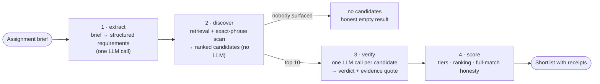

# How the CV matcher works

Paste a client assignment request, get a ranked shortlist of
consultants where every credited requirement is backed by a verbatim
quote from the CV, every gap is named, and "nobody fully fits" is said
out loud. This document explains the mechanism end to end: what each
stage does, the rules it follows, how the result is measured, and where
the known soft spots are.

It is written for the people who will use or evaluate the tool —
staffing managers, colleagues, reviewers — not only for developers.
Code references are given for the curious; nothing here requires
reading them. The rehearsed live demo is in
[guides/STAFFING_DEMO_SCRIPT.md](guides/STAFFING_DEMO_SCRIPT.md); the
measurements behind every number are in
[../EXPERIMENTS.md](../EXPERIMENTS.md) (Experiments 27 and 29).

## The pipeline in one picture



The split matters: **retrieval discovers, the model verifies, and
arithmetic decides.** Retrieval is cheap and touches every consultant;
the model is expensive and only sees the ten most plausible; the final
ranking is plain counting over verified facts, so nothing in the
result depends on a similarity score the reader cannot inspect.

(Implementation: a LangGraph `StateGraph` in
`src/ragstone/match/matcher.py`, nodes `extract → discover → verify →
score`, with a conditional edge to `no_candidates`.)

## Before matching: CVs become person-tagged chunks

- **Any common format.** PDF, DOCX, Markdown and plain text are loaded
  and split into chunks (the engine's validated defaults, 1000
  characters with 200 overlap).
- **Every chunk knows whose it is.** Each chunk is stamped with a
  `person_id` and `person_name` derived from the file name. The bundled
  bench uses the strict convention `cv08_anders_nielsen.md`; uploaded
  real CVs use a lenient rule where *every file is one person* and the
  name comes from the file name (`Firstname_Lastname_CV.docx`).
- **Hybrid index.** Chunks go into both a BM25 (keyword) index and a
  vector index; the person tags ride along on every retrieved chunk.
- **No model calls at ingest.** The engine's optional per-document
  "metadata cards" are switched off for matching: verification reads
  full CVs anyway, and ingest stays deterministic and free.
- **Uploads replace the pool.** In the UI, uploading CVs means "match
  against these files", not "add to the bench".

## Stage 1 — Extract: the brief becomes structured requirements

One model call turns free text into a requirement list, and it works
*line by line*: the model copies every sentence or bullet of a
requirements or preferred section verbatim, labels it must or nice,
states whether the items it names are **all** required or
**alternatives**, and lists them. Code does the rest. That shape was
chosen by measurement (Experiment 30): rules written in prose did not
stop a small model from reading "including A and B" as "A or B"; making
it label each sentence did.

Each must-have is one of five kinds; location is captured as context:

| kind | example label | what it means |
|---|---|---|
| skill | `AUTOSAR Classic or AUTOSAR Adaptive` | a named technology, tool or standard; alternatives satisfy it interchangeably |
| years | `at least 5 years of experience` | total professional experience |
| language | `Swedish (working proficiency)` | a spoken working language |
| domain | `automotive domain experience` | substantial project experience in an industry |
| education | `university degree in Computer Science` | a degree, verified against the CV's education section |
| *location* | `Gothenburg (hybrid)` | where the role is based; context and a per-candidate note, never a gap |

Plus a list of nice-to-haves (meriting skills).

Rules the extractor is held to:

- **Section headings decide.** Items under "Requirements", "Mandatory",
  "Required" or "Krav" are must-haves; items under "Preferred",
  "Meriting", "Nice to have" or "Meriterande" are nice-to-haves and are
  never promoted, however strongly the prose stresses them. "About",
  "Responsibilities" and "Personal qualities" are skipped.
- **Lists are conjunctions unless the text says "or".** "including
  AUTOSAR Classic and CAN bus" is two requirements; "ISO 26262, MISRA C"
  is two; "C++, Python, Java" is three. "Jenkins or GitLab CI" is one
  requirement with two alternatives.
- **Programming languages are skills.** The language kind is for spoken
  languages only, and a language is never inferred from the language
  the brief is written in.
- **Years, language, domain and degree only when stated as
  requirements**, not as preferences; a sentence with a degree and a
  years count yields two items.
- **Brief language is irrelevant.** A Swedish brief produces the same
  structure as an English one; requirements are structured, not
  string-matched.

The matcher reads *only* the brief. The bench's answer key never enters
the pipeline.

## Stage 2 — Discover: who could possibly fit

Discovery finds candidates without spending an LLM call — its only
model use is embedding each query for vector search, which is cheap
and non-generative. Every consultant in the pool is considered.

**Retrieval per requirement.** Each requirement becomes its own
query: a skill's alternatives are searched as written, a language by
its name, a domain as "*domain* projects". Years are not searchable and
are left to verification. The hybrid retriever returns the top *k*
chunks per query (*k* = 12 by default for matching, wider than the
question-answering default of 4, because a 40-person pool needs a wide
net), and hits are aggregated per person.

**Exact-phrase scan.** Retrieval rank alone is a poor gatekeeper for
*named* skills: a true match whose mention is textually weak can lose
its top-*k* slots to near-miss profiles. This was measured — on the
Swedish brief, several "AUTOSAR Adaptive" CVs crowded out a safety lead
who lists "AUTOSAR Classic" once. So a second channel scans every
person's full CV text for the exact requirement phrase, with word
boundaries so that "Embedded C" does not match inside "Embedded C++".
If the phrase is there, the person is a discovery candidate for that
requirement whatever the retriever ranked. Verification still decides
coverage.

**Ranking by coverage breadth.** Candidates are ordered by how many
*distinct* must-haves they surfaced for, then by nice-to-have hits, then
by a small retrieval-rank credit as a tiebreak. Ten CAN-bus chunks must
not outweigh one AUTOSAR chunk.

**The cap.** The top ten go on to verification
(`MAX_VERIFIED_CANDIDATES = 10`). Everyone is scanned; only ten are
priced. The cap is sized for a pool of tens; a pool of thousands would
want a cheaper pre-ranking stage, not a wider model pass. In every
measured run, at 40 and at 400 consultants, the cap never excluded a
true strong candidate.

**Nobody surfaced?** The graph takes the `no_candidates` branch and
returns an honest empty result ("consider relaxing the must-haves")
instead of dredging up the least-bad profile.

## Stage 3 — Verify: turning hits into claims

For each shortlisted candidate, one model call reads the **full CV**
against **every must-have** and returns, per requirement, a verdict and
a quote. This is the stage that turns "the CV mentions it" into "the
CV evidences it".

The verifier is held to strict rules, quoted from the prompt:

- *covered = true only when the CV explicitly supports it; a technology
  the CV never mentions is NOT covered.*
- *A related or sibling technology does NOT count — a different
  variant, edition, or generation is a different technology. AUTOSAR
  Classic is not AUTOSAR Adaptive; Embedded C is not C++.*
- *Alternatives within one requirement ("X or Y") are interchangeable —
  any one suffices.*
- *For a years-of-experience requirement, add up the engagement
  periods.*
- *Quote the single most convincing CV line as evidence, verbatim, at
  most 25 words; use "" when not covered.*

Two safety properties, one arithmetic override, and a second vote:

- **Years are computed, not quoted.** The CV's engagement date ranges
  ("2019-2022", "2021 – present", "Jan 2019 - Mar 2022") are merged as
  intervals and their union decides the years requirement. When the CV
  has an Experience-like heading, only ranges under it count — degrees,
  certificates and summary timelines elsewhere are ignored whatever
  their layout; without one, Education blocks and degree lines are
  excluded. The evidence lists the exact spans counted. A profile
  blurb claiming "11 years" cannot pass on the blurb; the model's own
  reading is used only for a CV that carries no dates at all.
- **A credited skill must be named by the CV.** After the model's
  pass, every credited skill is checked by code: if the quote names the
  skill and occurs verbatim in the CV, it stands; if the quote is weak
  or invented, the first CV line that names the skill becomes the
  evidence; if no line names it, a product name (AUTOSAR Classic, ISO
  26262, C++) flips to "not evidenced" — the model had credited a
  sibling, such as Android for Java or Vector CANoe for CAN bus. A
  generic phrase the CV never names ("hardware interfacing") has no
  name to look for, so a stricter quote-only judge decides, with one
  repair call whose answer must occur in the CV. Years, degree,
  language and domain are exempt: the first is arithmetic, the rest
  are holistic readings. Measured on the scale test, this caught the
  one lenient credit the earlier experiments had left open and raised
  top-5 precision from 0.925 to 0.950.
- **Fail closed.** If the model returns unparseable JSON, the call is
  retried once; if it still fails, every requirement is recorded as not
  covered. The pipeline never invents coverage to fill a gap.
- **Nice-to-haves are not verified.** They are discovery signals used
  for ranking; each candidate shows every preferred item with a tick
  or a cross for whether the CV names it (leniently: the singular, or
  the first two words of a long phrase), never as a claim.

Verification calls are independent per candidate and run concurrently
(up to eight at a time). On the cloud provider this took a match from
roughly 24 seconds to roughly 10. A single local Ollama server
serializes requests, so concurrency does not help there.

### A worked example

Priya Aaltonen (a synthetic bench persona, 11 years of AUTOSAR Adaptive
and C++ in automotive) screened against an Embedded Linux platform
brief:

| requirement | evidenced | evidence (verbatim from CV) |
|---|---|---|
| Embedded Linux | ✅ | "Developed critical components using AUTOSAR Adaptive and Embedded Linux, focusing on system reliability." |
| Yocto | ❌ | — |
| Embedded C | ❌ | — |
| Device drivers | ❌ | — |
| at least 4 years of experience | ✅ | Engagement dates 2015–2026 add up to about 11 years (computed from the CV's date ranges, not quoted) |

Eleven years of C++ did not earn Embedded C. That is the sibling rule
doing exactly what a careful staffer would do. Priya lands in the weak
tier with the gap line *"Not evidenced in the CV: Yocto; Embedded C;
Device drivers."*

## Stage 4 — Score: tiers, ranking, honesty

No model is involved here; it is counting over verified facts.

**Tiers.** *Strong* = every must-have evidenced. *Partial* = exactly one
missing. *Weak* = two or more missing.

**Ranking.** Fewest missing must-haves first; then more nice-to-have
hits; then more covered items; then a stable tiebreak. Requirement
coverage, not raw similarity.

**Full-match honesty.** `full_match_exists` is true only if at least
one candidate is strong. The summary line says one of two things:

> *3 candidate(s) meet every must-have: … Ranked by verified coverage,
> then meriting skills.*

> *No candidate meets every must-have — this is stated rather than
> papered over. Closest: ‹top-ranked candidate› (Not evidenced in
> the CV: secure boot).*

**Gap wording.** Every missing item is reported as *"Not evidenced in
the CV: …"* — absence of evidence, not evidence of absence. A CV that
never mentions Kubernetes is not proof the person cannot use it, and
the wording must not pretend otherwise. The tool proposes and names the
gap; the staffing manager decides.

## What the reader sees

The dedicated UI (`make run-match-ui`) renders everything from one
result object — no follow-up queries.

- A **live event stream** while the graph runs: requirements extracted,
  each discovery query and its hit count, the shortlist, one line per
  candidate being verified, then the result.
- The **brief as read**: must-haves, preferred items and location,
  above the shortlist, so nobody has to guess why a skill is or is not
  in a coverage table.
- The **shortlist** with tier badges and the honesty summary.
- Per candidate, a **coverage table**: every requirement, evidenced or
  not, with the verbatim quote.
- A **CV expander** showing the source with every quoted span
  highlighted — click through and check.
- A **gap warning** on partial and weak candidates with the "not
  evidenced" line, and every preferred item ticked or crossed.
- The **location**, when the brief states one, on the requirements
  line and as a one-line note per candidate ("mentioned in the CV" or
  "not mentioned — informational, not a gap").

The same pipeline is what the eval harness scores, so what the demo
shows is what the numbers measure.

## How we know it works

**Ground truth by construction.** The bundled bench is 40 synthetic
Nordic consultant CVs *rendered from persona specs*, so for every brief
we know exactly who is strong, who is partial and what each partial's
one gap is. That answer key is what testers call an oracle; every metric below compares against it. The matcher never sees it. Eleven briefs cover the
interesting cases: one deliberately unsatisfiable (a08: nobody combines
5G, Kubernetes and secure boot), one in Swedish (a09), and two
long-form RFQs (a10, a11) in the shape real requests arrive in —
sectioned prose with "including" conjunctions, comma lists, a degree
sentence, the location only in prose, and a preferred item that must
not be promoted. A second bench scales the same idea to 400
consultants.

**Three gated metrics, one informational.**

| metric | what it catches | gated |
|---|---|---|
| strong_recall_at_5 | a candidate the answer key marks strong missing from the top 5 — a matcher bug, since their CV literally contains the skills | yes |
| full_match_accuracy | claiming a full match when none exists (or vice versa); a08 is the trap | yes |
| ordering_clean_rate | an out-of-tier candidate ranked above a strong one | yes |
| extract_must_recall / extract_must_precision | the extracted must-have list against the answer key's, item by item — a dropped or merged requirement that the pool happens to forgive | yes |
| gap_alignment | for surfaced partials, whether the verifier finds exactly the one gap the answer key names | informational |
| extract_stability | with repeated extraction samples, the share of briefs whose requirement list comes back identical | informational |

"Gated" means CI compares the score against the committed baseline with
a fixed tolerance and fails the build on regression. Two house rules
keep the gate honest: every quality-affecting change is measured before
it lands, and the answer key and the system under test are never edited
in the same measured comparison.

**Results.**

| arm | strong recall@5 | full-match honesty | ordering | per assignment |
|---|---:|---:|---:|---:|
| 40 consultants, 11 briefs, gpt-4o-mini | 1.000 (31/31) | 1.000 (11/11) | 1.000 (10/10) | ~9 s |
| 40 consultants, 9 briefs, fully local (qwen3.5:9b + embeddinggemma) | 1.000 (26/26) | 1.000 (9/9) | 1.000 (8/8) | 10–20 min on a laptop |
| 400 consultants, gpt-4o-mini | 0.950 (38/40) | 1.000 (9/9) | 1.000 (8/8) | ~9 s |

**The imperfections are attributed, not hidden.** The two lost slots
at 400 consultants are one candidate the answer key marks partial whom
the verifier credited for industry experience on adjacent evidence
(the domain kind is exempt from the second vote by design) and one
ranking case; the sibling-technology credit that used to be the third
was caught by the second vote. Discovery held everywhere: no strong
candidate was lost to the cap or to ranking, and honesty was perfect at
scale (zero strong for a08 at 400 people, said so in every run). The informational
gap_alignment tracks the same softness: about 0.9 at 40 consultants,
about 0.8 at 400. Extraction itself scores 0.984 recall and precision
on the eleven briefs; the two misses are the Swedish brief's domain
word and one head-noun requirement the answer key does not carry. The
local row above was measured on the nine-brief bench and is due for
re-measurement on eleven.

## Privacy posture

CVs are personal data under the GDPR, and the design treats that as a
structural requirement rather than a disclaimer.

- **Fully local option, measured.** With the Ollama provider the whole
  pipeline — embeddings, retrieval, verification — runs on the machine
  holding the CVs, at identical gated scores to the cloud stack. The
  cost is time on a laptop; it is a hardware question, not a quality
  gap.
- **Enforced no-egress profile.** `RAGSTONE_PROFILE=local` refuses to
  start if any external service is configured — cloud models, web
  loaders, LangSmith tracing — so "local" cannot silently leak.
- **Uploads never leave the machine.** Files dropped into the UI are
  written to a local temporary directory and indexed in-process.
- **Tracing is opt-in and off by default.** If LangSmith tracing is
  enabled for debugging, every prompt — including CV text — is sent to
  LangSmith's cloud. Keep it off when matching real CVs, or use a
  region and agreement that permits it.
- **The repo ships only synthetic CVs** (`@synthetic.example`
  addresses), and the tool is framed as human-in-the-loop decision
  support: a cited shortlist with named gaps, never automated
  selection.

## Known limits and the next levers

- **Verifier leniency is now confined to holistic kinds.** Named
  skills are checked by code and generic phrases by a second judge; a
  domain or a degree can still be credited on adjacent evidence, and
  that is where the scale test's remaining miss sits.
- **Years depend on parseable dates.** The arithmetic reads year
  ranges on engagement lines; a CV that gives durations in prose only
  ("three years at …") falls back to the model's reading, which can be
  swayed by a summary blurb.
- **The cap is a constant.** Ten verified candidates suits pools of
  tens to hundreds. Thousands would need a cheaper pre-rank stage
  before the model pass.
- **Nice-to-haves are unverified.** They rank, they do not claim.
- **Location is informational.** A CV that names another city is a
  conversation about availability, not missing evidence, so it never
  changes a tier.
- **The Swedish brief's domain word is missed.** Skills, years and
  language cross the language boundary; "fordonsindustrin" as a domain
  requirement does not yet. Tiers are unaffected on the bench.
- **Local throughput.** A single Ollama server serializes model calls,
  so the concurrent verifier gains nothing there; a GPU server that
  batches requests (or more workers behind vLLM) would.
- **Out of scope by design.** Availability, rates, soft skills and
  interview signal are not modelled. The output is a starting
  shortlist for a human, not a decision.

## Running it

```bash
make run-match-ui                          # the dedicated UI, port 8501
python evals/run_staffing_eval.py          # the measured gate (cloud)
python evals/run_staffing_eval.py --verbose --limit 1        # one brief, full detail
python evals/run_staffing_eval.py --provider ollama --ollama-reasoning off   # local stack
python evals/generate_staffing.py          # regenerate the synthetic bench
```

Where things live:

| what | where |
|---|---|
| the graph, prompts, ranking and scoring | `src/ragstone/match/matcher.py` |
| the UI | `src/ragstone/ui/staffing_app.py` |
| the bench: CVs, briefs, answer-key generator | `evals/corpus_staffing/`, `evals/golden_staffing.jsonl`, `evals/generate_staffing.py` |
| the 400-consultant bench | `evals/corpus_staffing_xl/`, `evals/golden_staffing_xl.jsonl` |
| the eval harness and gate | `evals/run_staffing_eval.py`, `evals/baseline.json` |
| the measurements | `EXPERIMENTS.md`, Experiments 27 and 29 |
| the live-demo runbook | `docs/guides/STAFFING_DEMO_SCRIPT.md` |
