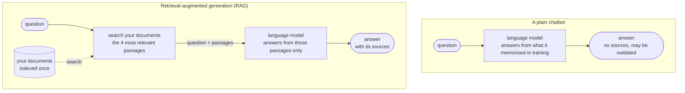
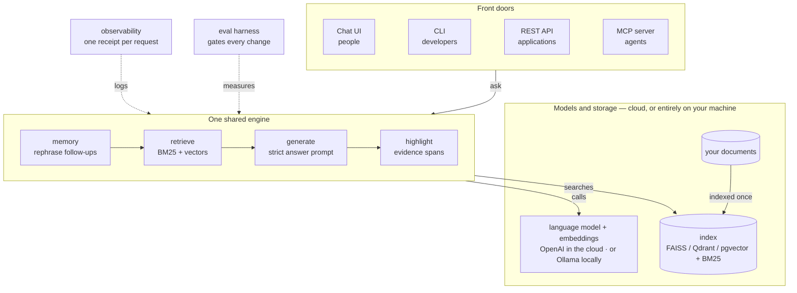
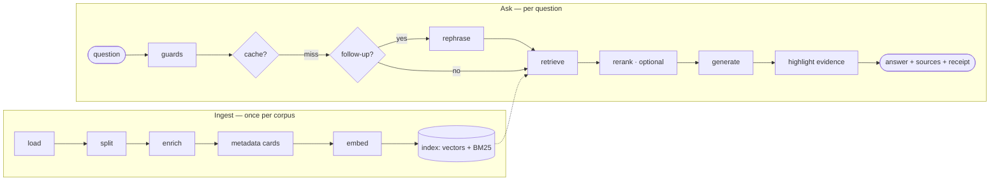

# How ragstone works

Documents in, cited answers out. ragstone is a retrieval-augmented
generation (RAG) engine: it indexes your documents once, and for every
question it retrieves the few passages that matter, asks a language
model to answer *from those passages only*, and shows you which source
words the answer was built from. It runs on cloud models or entirely on
your own machine, and every default in it was chosen by measurement.

This document explains the mechanism end to end for the people who
will use, evaluate or extend it — not only developers. The design
reasoning (why each choice was made, what was measured and rejected) is
in [../ARCHITECTURE.md](../ARCHITECTURE.md); the full experiment log
is [../EXPERIMENTS.md](../EXPERIMENTS.md); the CV-matching showcase
built on top of this engine has its own explainer,
[CV_MATCHING.md](CV_MATCHING.md).

## If RAG is new to you: one picture

A language model answers from what it memorised during training. It
has never seen your documents, and retraining it for every new file is
neither practical nor private. Retrieval-augmented generation adds one
step: at question time, *search* your documents for the few passages
that matter, and hand those passages to the model together with the
question, with the instruction to answer from them only. The answer
comes back with the passages it used, so it can be checked.



The search hop is the whole difference. Everything else in this
document is about doing that hop well — and proving that it works.

## The architecture at a glance

Four front doors, one engine, and a choice of where the models run.



- **Front doors** are thin: each one turns a request into a call on
  the same engine, so a feature added to the engine appears in all
  four.
- **The engine** is the ask path described below: remember the
  conversation, retrieve, generate, highlight.
- **Models and storage** are swappable. The same engine runs on OpenAI
  or on Ollama on your own machine; the index can be in-process or a
  server you already operate. Under the local profile nothing leaves
  the machine.
- **The eval harness and observability** are not add-ons: every
  default in the engine was decided by the harness, and every request
  leaves a receipt.

## The design bet

**RAG is the foundation agents stand on, not the thing agents
replaced.** So the default path is a fixed, deterministic pipeline:
one retrieval, one answer call, predictable latency and cost.
Everything more sophisticated — query expansion, self-correcting
retrieval, an agent loop — exists as an opt-in whose cost and quality
are measured against that baseline on your own corpus. Several of
those opt-ins lost their own experiments and are kept anyway, honestly
labelled, for the corpora where the trade-off flips.

## Two paths in one picture



Ingest is paid once and is mostly free of model calls. Ask is the hot
path: on a first-turn question with the default chain it costs exactly
one retrieval and one model call.

## Ingest: documents become a searchable index

1. **Load.** Local text, Markdown, PDF, Word and CSV files (recursively
   from a directory, or uploaded in the UI); web pages and Wikipedia
   articles as remote sources.
2. **Split.** Documents are cut into chunks of 1000 characters with 200
   overlap. Smaller chunks were measured and rejected: at 500
   characters, retrieval hit rate *dropped* from 1.0 to 0.914 because
   facts got separated from their subjects.
3. **Enrich.** Each chunk gets a one-line identity prefix naming its
   source document, so "clean every 4 months with a microfiber cloth"
   embeds differently depending on which product manual it came from.
   Deterministic and free; measured at +1.5 points hit rate and +2.9
   points faithfulness for +5.7 % tokens. A single-document corpus gets
   no prefix — there is nothing to disambiguate, and the prefix was
   found live to hurt there.
4. **Metadata cards.** One extracted title/authors/date chunk per
   document, so "who wrote this paper?" retrieves the author block
   instead of the references section that decoys every authorship
   query. One model call per document at ingest; on by default, can be
   switched off.
5. **Embed.** Chunks are embedded with `text-embedding-3-small`
   (cloud) or `embeddinggemma` (local), in concurrent batches —
   measured 3.1× faster with identical vectors. An embedding cache
   makes re-ingestion incremental: unchanged chunks are never
   re-embedded.
6. **Index.** Two indexes are built over the same chunks: a vector
   index (FAISS in-process by default; Qdrant or pgvector as optional
   server-backed stores with a retrieval-parity test) and a BM25
   keyword index. Both carry the chunk's metadata.

## Ask: what happens to a question

**1 · Guards.** The question is type-checked, must be non-empty and is
length-capped — rejected *before* any cache lookup or model spend.

**2 · Cache (opt-in).** An exact-match cache keyed on the question and
the corpus. Deliberately not semantic: a similarity-based cache was
built, measured and removed because its thresholds either returned a
cached answer for a materially different question or never fired.

**3 · Memory.** Conversations live in a small LangGraph graph
checkpointed per session. On a first turn nothing happens here. On a
follow-up, one cheap model call rewrites the question into a
standalone one: pronouns and vague references ("it", "the panels") are
replaced by the entities they refer to, comparative questions name
every entity being compared, and a challenge like "are you sure?"
restates the *question* being challenged rather than the answer. The
history stores the user's original words; the rephrase is an internal
retrieval artifact, shown in the UI as "interpreted as…". Sessions are
bounded at 40 messages. This step sits on the critical path and was the
single largest fixable latency in the system (about 926 ms per
follow-up), which is why its prompt and model are tuned and measured.

**4 · Retrieve.** The standalone question goes to a hybrid retriever:
BM25 keyword search and vector similarity, combined at 0.4 / 0.6, top
*k* = 4 chunks. *k* = 4 is the measured coverage knee — 2 loses answers,
6 adds nothing. Optionally, a local cross-encoder reranker rescores a
wider pool of 20 candidates and keeps the best 4; it is the biggest
ranking lever measured (MRR 0.931 → 1.000 on the smoke set) at the cost
of an ~80 MB local model and some latency.

**5 · Generate.** One model call with the retrieved chunks as context.
The prompt is deliberately plain and deliberately strict:

> *Use the following pieces of retrieved context to answer the
> question. If you don't know the answer, just say that you don't
> know. Use only names, numbers, and model identifiers that appear in
> the context — never invent or embellish them. Use three sentences
> maximum and keep the answer concise.*

Temperature is 0 on both providers (determinism for factual answers;
measured steadier on local multi-turn). The answer streams token by
token; only the final answer's tokens reach the stream, never the
internal query-generation text of the fancier chains.

**6 · Highlight evidence.** After the answer exists, it is aligned
against each retrieved snippet by longest common word sequences and
the matching character spans are highlighted in the sources. No prompt
change, no model call, deterministic. Paraphrases do not highlight, by
design: a highlight is a verbatim-level claim, and fewer true highlights
beat fuzzy ones.

**7 · The receipt.** Every request — success, cache hit *or* failure —
emits one structured log line: a correlation id (the REST API adopts
the client's `X-Request-ID`), session, chain, cache flag, total
latency, tokens across every model call the request needed, and a
per-stage breakdown (rephrase, retrieval, generation). The UI's
glass-box panel shows the same data with an estimated cost.

## The chain types

The default chain is `simple`: retrieve once, answer once. The others
are opt-ins with a measured niche and an explicit enable-when.

| chain | what it does differently | measured verdict | enable when |
|---|---|---|---|
| `simple` (default) | one retrieval, one answer | the measured optimum on the eval corpus; CI-gated | — |
| `multi_query` | the model writes several phrasings of the question; retrievals are merged | no gain on either corpus; multi-turn faithfulness *drops* on the regulatory one | rarely — measure first |
| `fusion` | several phrasings merged by reciprocal-rank fusion | no gain on the fictional corpus; **best chain on the regulatory corpus** (+10.7 points correct, 0.982 faithful) at 2.3× tokens | passages near-duplicate each other (recitals mirroring articles, versioned clauses) |
| `corrective` | retrieval grades itself; irrelevant results trigger a rewrite and a retry, bounded; after that it refuses *with evidence* | faithfulness 0.986 vs 0.967 at n = 224; an apparent correctness win at n = 43 failed to replicate | a wrong answer costs more than a refusal |
| `auto` | a cheap classifier routes each question to `simple` or `corrective` | corrective's edge on flagged questions at 1.25× tokens instead of 2× — still failed its pre-set cost gate | you want corrective's insurance without paying it on every lookup |
| `agent` | the model gets the retriever as a tool and drives the loop itself: search, read, search again, answer | identical quality, 1.8× latency, 1.45× tokens | first-shot retrieval misses often enough that re-searching pays — measure on your corpus |

Every chain honours the same contract, so memory, caching, the UI,
the REST API and the MCP server work unchanged; a chain's internal
steps (agent searches, corrective grades and rewrites, the router's
choice) surface as typed live events in the UI and as named
server-sent events in the API.

## Four front doors, one engine

- **Streamlit chat UI** for humans: answer with sources and
  highlights, the glass-box panel (interpretation, stages, tokens,
  cost), and a compare mode that runs two chain variants side by side
  on the same retriever.
- **CLI chat** for development.
- **REST API** for applications: `/pipelines` to create and load,
  `/pipelines/{id}/ask` with streaming server-sent events, per-session
  memory endpoints, `/health`, `/ready`, `/metrics`, `/usage`. API-key
  auth, a concurrency cap that answers 429 immediately instead of
  queueing, and typed errors mapped to precise HTTP codes with details
  kept in the server log.
- **MCP server** for agents: the same operations as tools
  (`create_openai_pipeline`, `create_ollama_pipeline`,
  `load_documents`, `setup_retriever`, `ask_question`, …), so an agent
  can stand a document-grounded answerer up and query it.

The API and MCP server share one locked pipeline registry. Both run
boot checks that probe every configured endpoint (Ollama, Qdrant,
Postgres), model and credential up front and report every problem in
one message with the command that fixes it — instead of a stack trace
on the first unlucky request.

## How we know it works

**Two evaluation layers, both gated.**

| layer | what it measures | cost | metrics |
|---|---|---|---|
| retrieval | did the right chunks come back? (per-case "must contain" needles) | free, deterministic | hit rate, MRR |
| generation | was the answer correct against gold, and faithful to the retrieved context? | an LLM judge, cents | correct rate, faithful rate; multi-turn variants |

Multi-turn cases are scripted conversations run in one session; the
final turn is judged against the documents the pipeline *actually*
retrieved after rephrasing. That is the only place the rephrase step is
exercised, and its first run caught a real retrieval bug the day it was
written.

**Golden sets.** A 49-case smoke set on a bundled fictional corpus
(with distractor and multi-hop categories), a 224-case large set on an
extended universe engineered for confusion, a 68-case set on *real*
documents (EU regulations whose recitals paraphrase their own
articles), a single-document set for a failure class found live, and
the two staffing benches.

**The gate.** Every configuration's scores are committed to a baseline;
CI fails the build if any metric drops more than 0.05 below it. The
harness also charts the project's own quality history straight from
git — no hand-typed numbers.

**Results on the smoke set** (k = 4, committed baselines; "mt" is the
multi-turn variant):

| configuration | hit rate | MRR | correct | faithful | mt correct / faithful |
|---|---:|---:|---:|---:|---:|
| gpt-4o-mini, `simple` | 1.000 | 0.952 | 0.951 | 1.000 | 0.875 / 0.875 |
| gpt-4o-mini, `simple` + reranker (retrieval layer) | 1.000 | 1.000 | — | — | — |
| gpt-4o-mini, `corrective` | 1.000 | 0.895 | 0.974 | 0.974 | 1.000 / 1.000 |
| gpt-4o-mini, `auto` | 1.000 | 0.931 | 0.974 | 1.000 | 0.800 / 1.000 |
| **fully local**: qwen3.5:9b + embeddinggemma, `simple` | 1.000 | 0.939 | 0.951 | 1.000 | 1.000 / 1.000 |

On the real regulatory corpus retrieval is harder for everyone (hit
rate about 0.8, cloud and local alike), and it is where `fusion`
earns its niche.

**The lessons the harness taught, in one table.**

| question | verdict |
|---|---|
| Does an agent loop beat the fixed pipeline? | identical quality at 1.8× latency, 1.45× tokens |
| Does self-correcting retrieval pay? | looked like +0.027 at n = 43, failed to replicate at n = 224 |
| Was the small eval set lying? | yes, once — scaling 43 → 224 reversed a conclusion; design verdicts now require the large set |
| Are smaller chunks sharper? | no — hit rate drops 1.0 → 0.914 at 500 characters |
| Where do follow-up seconds go? | 926 ms in one rephrase call → prompt fix took multi-turn correctness 0.8 → 1.0 |
| Is concurrent embedding safe? | 3.1× faster, identical vectors |
| Can a nano model do the rephrase? | −40 % latency and a green gate — then a live transcript showed it echoing answers on "are you sure?" turns; reverted the same day, blind spot added to the golden set |
| Does reasoning mode fix weak retrieval? | no — identical correctness at 33× latency; a better local embedder fixed what thinking could not |
| Does the thread model survive load? | p50 flat to 32 concurrent clients, instant 429s beyond the cap |

## Privacy and operations

- **Two providers, one code path.** OpenAI or Ollama for both the
  language model and the embeddings; the local stack (qwen3.5:9b +
  embeddinggemma) sits at the cloud reference on the smoke set.
- **No-egress is an enforced invariant.** `RAGSTONE_PROFILE=local`
  refuses cloud providers, remote document sources and phone-home
  tracing, validates every configured endpoint as loopback at boot,
  and is regression-tested by a socket-intercepting test over the full
  ingest-and-ask path.
- **Tracing is opt-in.** LangSmith works out of the box via
  environment variables and sends every prompt, including document
  text, to its cloud; the local profile forbids it.
- **Resilience.** Retries and timeouts are wired into every model and
  embedding client from config; input length is capped before any
  spend; the synchronous core is offloaded to worker threads by the
  servers, which measured flat latency to 32 concurrent clients.
- **Quality control.** About 600 tests, lint, type checks with zero
  suppressions, and the retrieval-eval gate run in CI; container images are
  scanned on a schedule.

## Known limits and the next levers

- **Verdicts are corpus-conditional.** Most defaults were decided on
  one fictional corpus and then put on trial on one real one, where
  one flipped (fusion). Your corpus may flip others; the harness exists
  so you find out instead of guessing.
- **Small local models break on conversation.** The edge-tier model
  matched the others single-turn but scored 0.63 on multi-turn
  correctness; the 9B workstation tier is the smallest that holds.
- **The rephrase step is on the critical path.** Every follow-up pays
  one extra model call before retrieval can start.
- **Highlights are verbatim-only.** A paraphrased answer shows fewer
  highlights, by design; it does not mean the answer is unsupported.
- **Metadata cards cost a model call per document** at ingest. Off
  them for corpora with no metadata questions.
- **Refusal is a chain feature, not a default.** The default chain
  answers or says "I don't know" from the prompt; grounded refusal
  after failed searches needs the `corrective` chain.
- **Not built, on purpose:** an async core (thread offload measured
  sufficient), a semantic cache (measured harmful), speculative
  retrieval (retrieval is ~150 ms; wrong target).

## Running it

```bash
make install-dev                      # venv + dev extras
make run-streamlit                    # the chat UI
python evals/run_eval.py --mode retrieval   # layer 1, free
python evals/run_eval.py              # both layers (needs an API key)
make eval-local                       # the local stack, measured
ragstone-api                          # REST API (ragstone[api])
ragstone-mcp                          # MCP server
```

Where things live:

| what | where |
|---|---|
| the pipeline: load, split, embed, index, ask | `src/ragstone/rag/pipeline.py` |
| chains: simple / multi_query / fusion, corrective, router, agent | `src/ragstone/rag/rag.py`, `corrective.py`, `router.py`, `agent.py` |
| conversation memory graph and the rephrase prompt | `src/ragstone/rag/memory.py` |
| enrichment, metadata cards, evidence highlighting, cache | `src/ragstone/rag/enrichment.py`, `citations.py`, `cache.py` |
| observability: the per-request log line and stage timing | `src/ragstone/utils/observability.py` |
| configuration, profiles and boot checks | `src/ragstone/config/settings.py`, `boot_check.py` |
| the four front doors | `src/ragstone/ui/`, `api/server.py`, `mcp/mcp_server_fastmcp.py` |
| the eval harness, golden sets and baselines | `evals/run_eval.py`, `evals/golden*.jsonl`, `evals/baseline.json` |
| the measurements and the reasoning | `EXPERIMENTS.md`, `ARCHITECTURE.md` |
